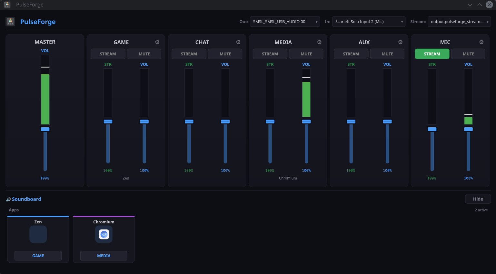
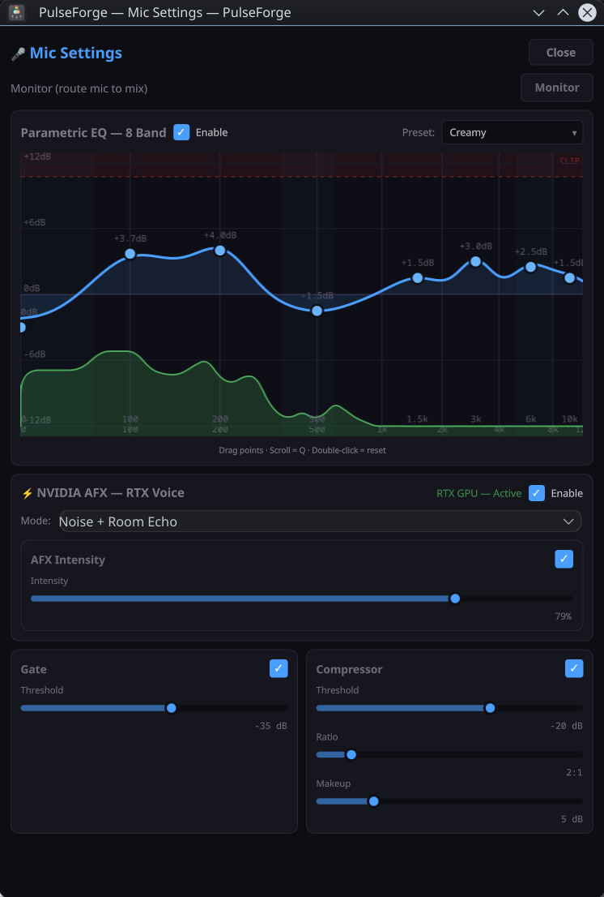
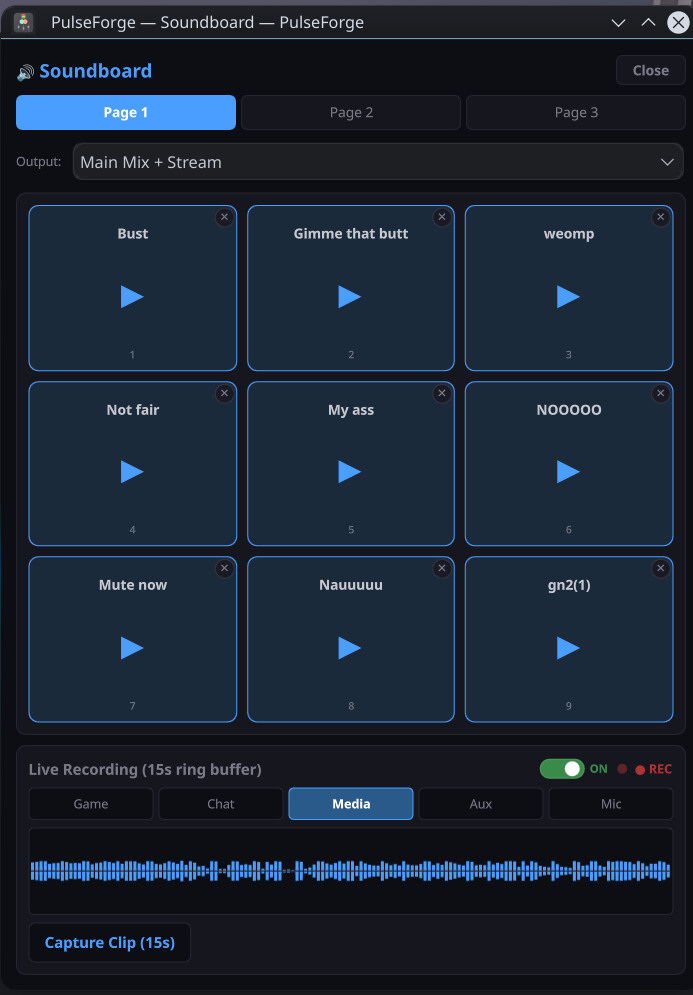
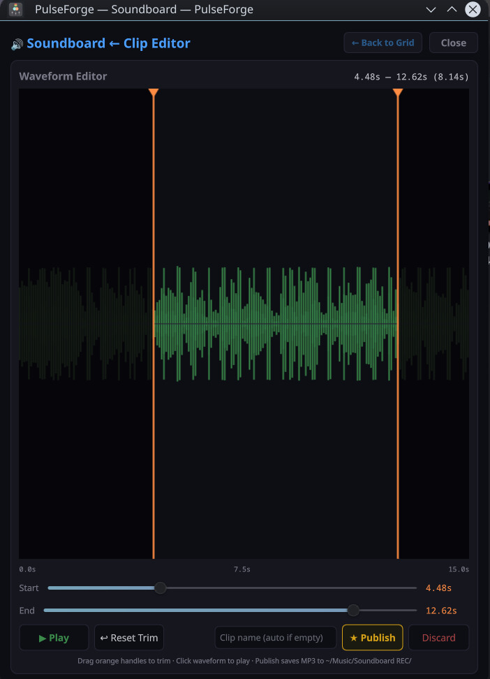

# 🎛️ PulseForge

**A virtual audio mixer for Linux that just works.**

Route apps to channels, process your mic with studio-grade DSP, and control your entire audio setup from one clean interface — no JACK, no PulseAudio bridges, no terminal gymnastics.

Built for PipeWire. Runs on any modern Linux desktop.

---

## What it does

Most Linux audio tools are built for audio engineers. PulseForge is built for people who just want their audio to sound good — streamers, gamers, podcasters, and anyone tired of wrestling with `pactl` commands.

### 🎚️ Full Mixer Control

- **5 channel strips** (Game, Chat, Media, Aux, Mic) + master output
- Independent **volume** and **stream mix** faders per channel
- Real-time **VU meters** with peak hold and clip detection
- One-click **mute** and **stream routing** per channel
- **App routing** — see every running app, assign it to a channel from a dropdown

### 🎤 Mic Processing

Studio-grade mic chain running in real-time, all parameters adjustable with zero latency:

- **AI Denoise** — DeepVQE speech-enhancement model (ONNX), strength slider, runs on CPU or GPU
- **Adaptive ambient NR** — FFT spectral subtraction for steady room tone (fans, AC, hiss)
- **Noise gate** — RMS-based detection with smooth attack/release, adjustable range floor, optional auto-threshold
- **8-band parametric EQ** — visual draggable curve, real-time FFT spectrum overlay, save/load presets
- **High-pass**, **multiband compressor**, and **output limiter** round out the chain
- Advanced stages live under an **Advanced** tab in the mic window

### 🎛️ Web Control Panel

- **Browser/VR control panel** served on `http://localhost:8765` while PulseForge runs
- Full mixer, mic, and soundboard control from any device on your network
- Real-time VU meters pushed over WebSocket — no page reloads
- Self-contained (Python stdlib + plain ES6), no build step

### 🔊 Stream Routing

- Independent **stream mix** — separate from what you hear
- Route any combination of channels to the stream output
- Creates a virtual microphone that OBS, Discord, and other apps can capture directly
- Your stream audio never touches your speakers — no echo loops

### 🥁 Soundboard

- **3 pages × 3×3 grid** of assignable sound slots — bind any audio file and trigger it live
- **Always-on channel recording** — a 15 s ring buffer per channel (Game, Chat, Media, Aux, Mic)
- **Live waveform** capture straight from any channel's monitoring tap
- **Clip editor** — trim with draggable handles, preview, then publish
- **Publish to MP3** (via ffmpeg) with **collision-safe naming** — if a name already
exists you get an in-app dialog to rename (auto-suggested `Name (1)`) or overwrite,
never a silent clobber
- Sounds play to the main mix and the stream mix by default, so viewers hear them too

---

## Screenshots

### Mixer

Channel strips with independent volume + stream faders, VU meters, and app routing.



### Mic processing

AI denoise, adaptive NR, noise gate, high-pass, 8-band parametric EQ with live spectrum, multiband compressor, and limiter. Advanced stages are grouped under an **Advanced** tab.



### Soundboard

3 pages × 3×3 grid of assignable sound slots with always-on channel recording.



### Clip editor

Capture from any channel, trim with draggable handles, preview, and publish to MP3.



---

## Getting started

### Prerequisites

| Dependency | Why | Install |
|---|---|---|
| **PipeWire ≥ 1.0** | Audio routing backbone | Pre-installed on most modern distros |
| **WirePlumber** | Session manager for PipeWire | Usually installed alongside PipeWire |
| **Python 3.11+** | Runtime | `python3 --version` to check |
| **PySide6 (Qt 6)** | UI framework | `pip install PySide6` |
| **numpy** | DSP math | `pip install numpy` |
| **onnxruntime** | AI denoise (DeepVQE model) | `pip install onnxruntime` |
| **ffmpeg** | Soundboard MP3 publish | `sudo pacman -S ffmpeg` / `sudo apt install ffmpeg` |

### Install system libraries

**Arch / CachyOS / Manjaro:**
```bash
sudo pacman -S pipewire wireplumber ffmpeg
```

**Fedora:**
```bash
sudo dnf install pipewire wireplumber ffmpeg
```

**Ubuntu / Debian (24.04+):**
```bash
sudo apt install pipewire wireplumber ffmpeg
```

### Install PulseForge

#### Option A: From source (recommended for now)

```bash
git clone https://github.com/rdv21/pulseforge.git
cd pulseforge
pip install .
```

Then launch with:
```bash
pulseforge
```

#### Option B: Run without installing

```bash
git clone https://github.com/rdv21/pulseforge.git
cd pulseforge
./pulseforge.sh
```

#### Option C: System-wide install with .desktop entry

```bash
git clone https://github.com/rdv21/pulseforge.git
cd pulseforge
sudo make install
```

This installs the app, desktop entry, and icon system-wide. Launch from your application menu or terminal.

---

## How to use

1. **Launch PulseForge** — it auto-detects your input and output devices
2. **Open apps** — they'll appear in the app routing panel. Assign each to a channel (Game, Chat, Media, Aux) from the dropdown
3. **Mix** — adjust volume faders for each channel. The master fader controls overall output
4. **Stream** — click the STREAM button on any channel to send it to the stream mix. OBS and Discord will see "PulseForge Stream Input" as a microphone
5. **Mic settings** — open the mic processing window to adjust AI denoise, gate, EQ, compressor, and the advanced stages in real-time
6. **Soundboard** — open the soundboard to bind sounds to the 3×3 grid, capture clips from any channel, trim, and publish
7. **Web panel** — browse to `http://localhost:8765` (from this machine or another device) for the same controls in a browser or VR overlay

### Tips

- **EQ presets**: Save your favorite EQ settings and switch between them instantly
- **Monitor**: Toggle monitor in mic settings to hear yourself through your speakers (useful for testing)
- **Device switching**: Change input/output devices from the main window — PulseForge reconnects automatically

---

## How it works

PulseForge creates virtual PipeWire sinks for each channel (Game, Chat, Media, Aux) and a master mix sink (Gaming). Apps are routed to channel sinks, which are mixed into the master sink, which connects to your hardware output.

For streaming, a separate virtual stream sink collects audio from any channels you enable, and a virtual source makes it available as a microphone input to OBS, Discord, etc.

The mic chain captures audio from your hardware mic via `pw-cat`, processes it through a Python DSP pipeline (AI denoise → adaptive NR → gate → HPF → EQ → multiband comp → limiter), and publishes it as a virtual source that apps can capture.

All processing happens in-process — no external PipeWire filter-chain processes to manage. Parameters update instantly when you move a slider.

A small built-in HTTP server (Python stdlib, no dependencies) serves the web control panel on port 8765 alongside the Qt UI.

---

## Configuration

Settings are stored in `~/.config/pulseforge/`:

- `config.json` — device selections, volumes, mic processing params
- `app-routing.json` — app-to-channel assignments
- `eq-presets/` — saved EQ presets as JSON
- `soundboard/` — soundboard slot bindings (`soundboard.json`)

---

## Requirements detail

- **PipeWire 1.0+** (tested on 1.6.9)
- **WirePlumber** (for session management)
- **Qt 6 with QML** (PySide6 ≥ 6.6)
- **Python 3.11+**
- **numpy ≥ 2.0**
- **onnxruntime** (AI denoise)
- **ffmpeg** (soundboard MP3 publishing)
- KDE Plasma recommended (for system theme integration), but any Qt-compatible desktop works

---

## Project layout

```
pulseforge/
├── backend/          # PipeWire control, DSP, mic chain, soundboard, web server
│   ├── pipewire_ctl.py    # sinks, volumes, loopbacks, routing
│   ├── native_chain.py    # mic chain: denoise → NR → gate → HPF → EQ → comp → limiter → pw-cat
│   ├── dsp.py             # Gate, EQ, Compressor, Limiter, AmbientNR, MultibandComp
│   ├── deepvqe.py         # AI denoise (ONNX DeepVQE model)
│   ├── soundboard.py      # slots, per-channel recording, clip edit/publish
│   ├── web_server.py      # stdlib HTTP + WebSocket control panel
│   ├── vu_meter.py        # VU polling
│   └── process_manager.py # pw-cat/pw-play lifecycle + orphan cleanup
├── qml/              # Qt/QML UI
│   ├── Main.qml           # mixer, routing, status bar
│   ├── MicSettingsWindow.qml
│   ├── SoundboardWindow.qml
│   └── components/        # ChannelStrip, Fader, VUMeter, ParametricEQ, …
├── web/              # browser/VR control panel (served on :8765)
├── main.py           # QML ↔ Python bridge + entry point
└── launch.py         # alternative launcher
```

---

## Contributing

This is a young project. If you want to help:

- Test on different distros and report what works/breaks
- File issues with `pactl list short sinks` and `pw-cli ls Node` output
- UI/UX improvements welcome — the QML is modular and well-organized

---

## License

MIT — see [LICENSE](LICENSE). Build something with it.
